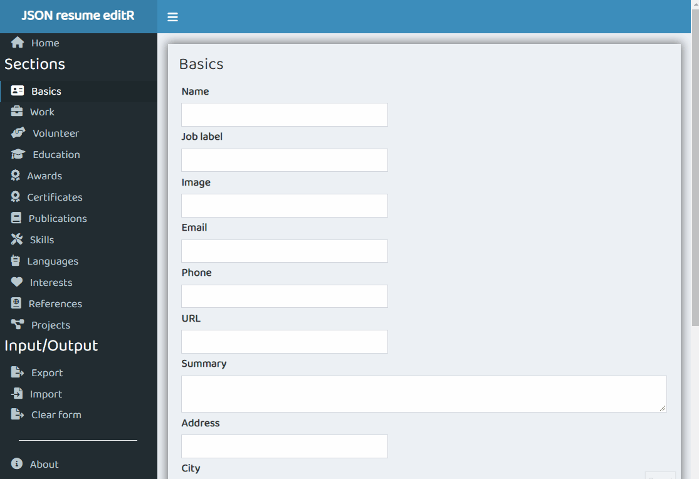

<!-- README.md is generated from README.Rmd. Please edit that file -->

```{r, include = FALSE}
knitr::opts_chunk$set(
  collapse = TRUE,
  comment = "#>",
  fig.path = "man/figures/README-",
  out.width = "100%"
)
```

# jsonResumeEditR

<!-- badges: start -->

[](https://github.com/Shaunson26/jsonResumeEditR/actions/workflows/R-CMD-check.yml)

<!-- badges: end -->

The goal of jsonResumeEditR is to create and maintain a [JSON resume](https://jsonresume.org/getting-started/)
using [R Shiny](https://shiny.rstudio.com/). The app lives within an R package, thus the package must be
installed and the app run from the package function `run_jsonResumeEditR()` (see below).

The app should be able to:

 - Allow user to edit fields within the JSON schema using inputs
 - Export to JSON
 - Import a JSON resume
 - Clear fields
 - TODO: Preview using a template builder
 - TODO: Send JSON to a user Github gist for https://jsonresume.org/ hosting

## Getting started

This project uses R and R Shiny. You will need first need R installed, so install
if you do not yet have it.

### R packages

You can install the development version of jsonResumeEditR from [GitHub](https://github.com/)
(and dependencies from CRAN)

``` r
# install.packages("devtools")
# install jsonResumeEditR with dependencies in DESCRIPTION file
devtools::install_github("Shaunson26/jsonResumeEditR", dependencies = TRUE)
```
## Start the app

The app lives

```{r, eval = FALSE}
library(jsonResumeEditR)

run_jsonResumeEditR()
```


