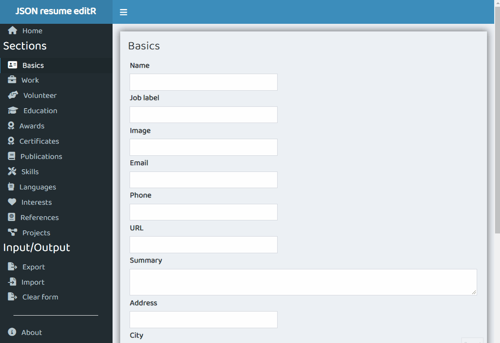

<!-- README.md is generated from README.Rmd. Please edit that file -->

# jsonResumeEditR

<!-- badges: start -->


[](https://github.com/Shaunson26/jsonResumeEditR/actions/workflows/R-CMD-check.yml)

<!-- badges: end -->

The goal of jsonResumeEditR is to create and maintain a [JSON
resume](https://jsonresume.org/getting-started/) using [R
Shiny](https://shiny.rstudio.com/). The app lives within an R package,
thus the package must be installed and the app run from the package
function `run_jsonResumeEditR()` (see below).

The app should be able to:

- Allow user to edit fields within the JSON schema using text inputs
- Export to JSON
- Import a JSON resume with the edit fields completed
- TODO: Send JSON to a user Github gist for <https://jsonresume.org/>
  hosting

## Installation

You can install the development version of jsonResumeEditR from
[GitHub](https://github.com/) with:

``` r
# install.packages("devtools")
devtools::install_github("Shaunson26/jsonResumeEditR")
```

## Start the app

The app lives

``` r
library(jsonResumeEditR)

run_jsonResumeEditR()
```


